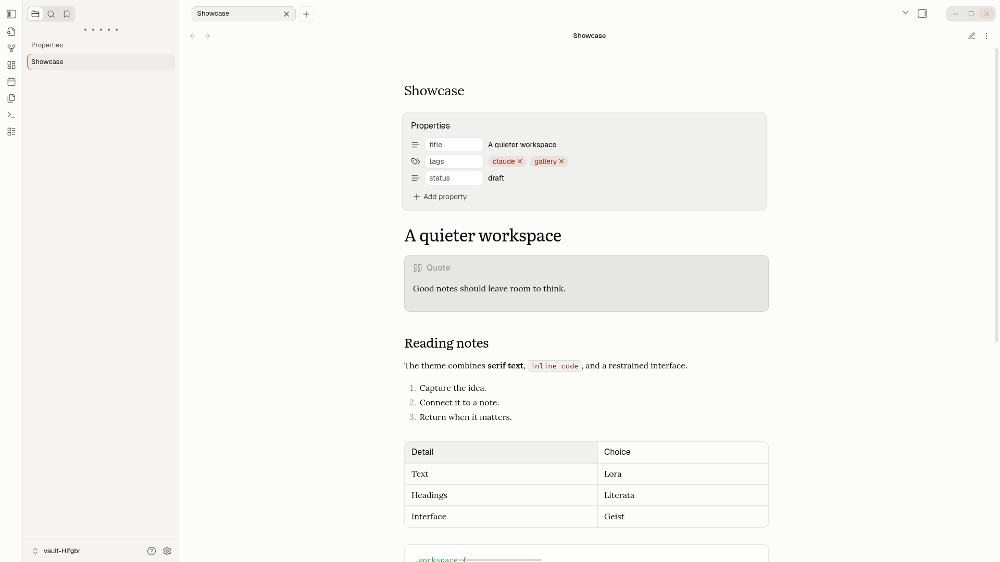
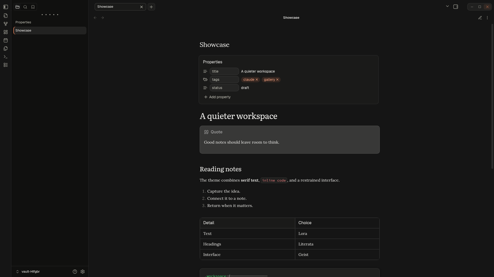

# Claude for Obsidian

A calmer place to read and write. An unofficial theme inspired by Claude,
with soft colors, serif typography, and a little more breathing room.

[](https://github.com/2chevskii/obsidian-theme-claude/releases/latest)
[](https://obsidian.md)
[](https://github.com/2chevskii/obsidian-theme-claude/actions/workflows/main.yml)
[](LICENSE)

[Install](#install) · [Customize](#customize) · [Screenshot gallery](assets/screenshots/README.md) · [Report an issue](https://github.com/2chevskii/obsidian-theme-claude/issues)

| Light | Dark |
| --- | --- |
|  |  |

## Make yourself at home

- **Light, warm, or dark.** Choose between two light palettes and a matching dark mode.
- **Type with character.** Lora for notes, Literata for headings, Geist Sans for the interface, and Source Code Pro for code. Fonts are bundled; no separate installation is needed.
- **A quieter workspace.** Floating tabs, recessed sidebars, and consistent styling for tables, properties, and dialogs.

## Install

Requires **Obsidian 1.10.6 or newer**.

1. Open [Releases](https://github.com/2chevskii/obsidian-theme-claude/releases) and download **`theme.css`** and **`manifest.json`** from the latest release's **Assets**. If no release is available, [build the theme from source](#contribute) and use the files in `dist/`.
2. Create a `Claude` folder inside your vault's `.obsidian/themes/` directory and place both files there:

   ```text
   Your vault/
   └── .obsidian/
       └── themes/
           └── Claude/
               ├── manifest.json
               └── theme.css
   ```

3. In Obsidian, open **Settings → Appearance → Themes** and select **Claude**.

If your vault uses a custom configuration folder, use that in place of `.obsidian`.
To update a manual installation, replace both files with those from the latest release.

## Customize

Choose light or dark mode in **Settings → Appearance**.

For a few extra controls, install and enable the optional
[Style Settings](https://github.com/community-archive/obsidian-style-settings)
community plugin. Open its settings and find **Claude** to:

- Switch the light palette between **Default** and **Warm**.
- Automatically hide the status bar until you hover near the bottom center of the window.
- Hide the Obsidian Sync status item.

## Contribute

Found something that looks off? [Open an issue](https://github.com/2chevskii/obsidian-theme-claude/issues)
with a screenshot, your Obsidian version, and the theme mode you're using.
Pull requests are welcome too.

To work on the theme, use **Node.js 24** and npm:

```sh
npm ci
npm run lint
npm run build
```

Edit the SCSS in [`src/`](src/); [`src/theme.scss`](src/theme.scss) brings the
theme modules together. The build produces `dist/theme.css` and
`dist/manifest.json`, with fonts embedded in the CSS. Copy both files into
your vault's theme folder to try your changes. For visual changes, check
light and dark modes and include screenshots in your pull request.

## License & credits

Theme code is released under the [MIT License](LICENSE). Bundled fonts use
the SIL Open Font License 1.1; see [third-party notices](THIRD_PARTY_NOTICES.md)
for attribution and license details.

Inspired by Claude. Not affiliated with or endorsed by Anthropic or Obsidian.
