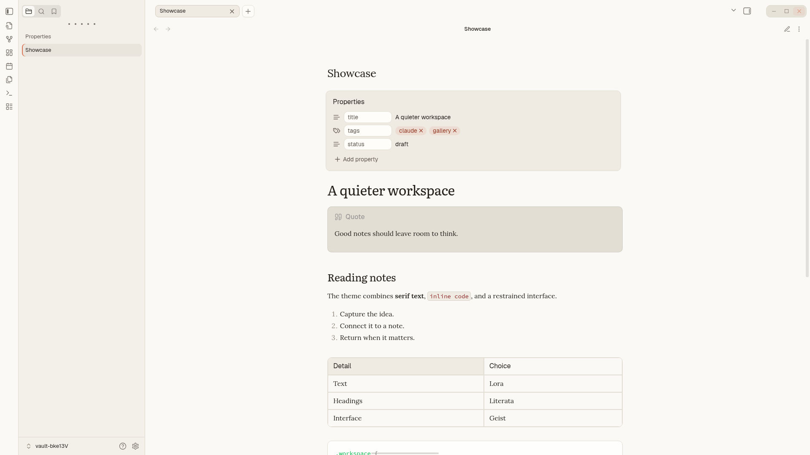
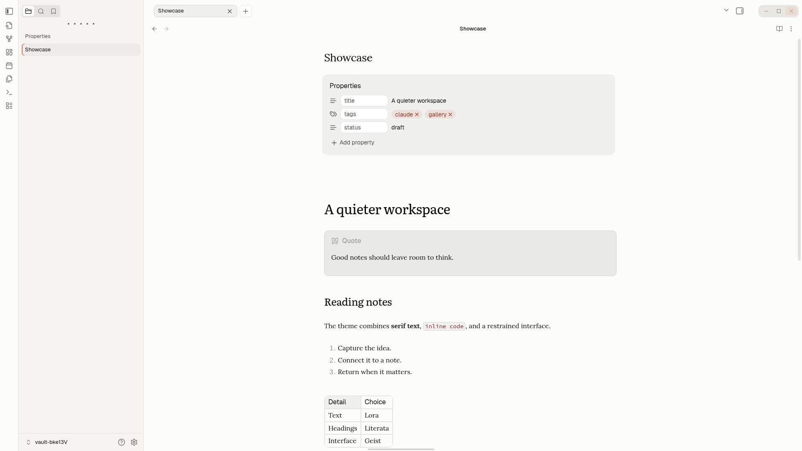
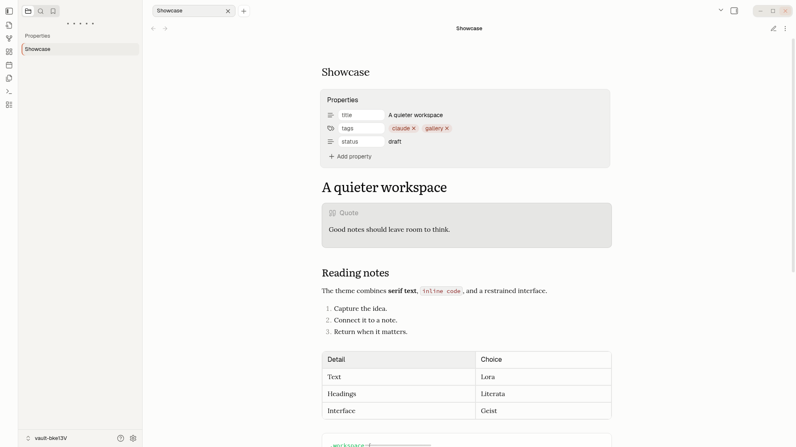
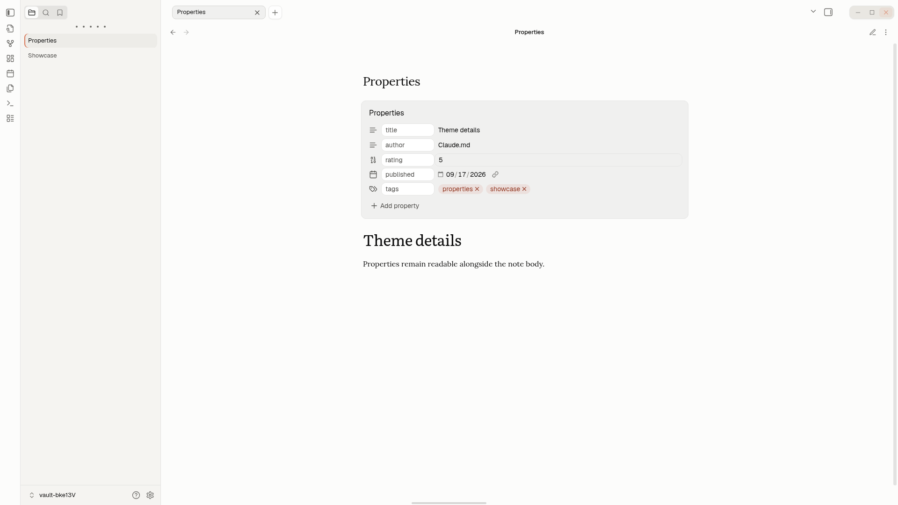
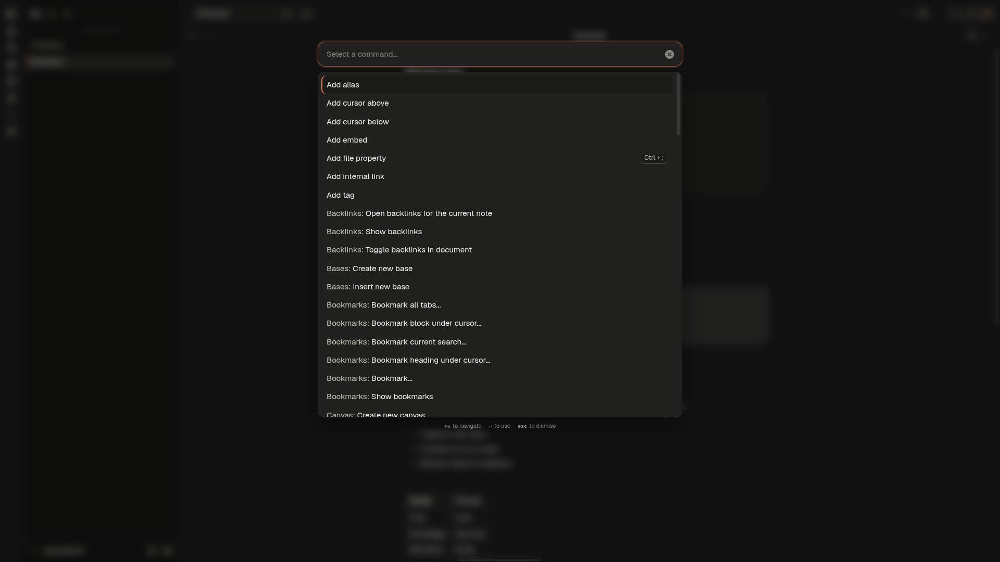
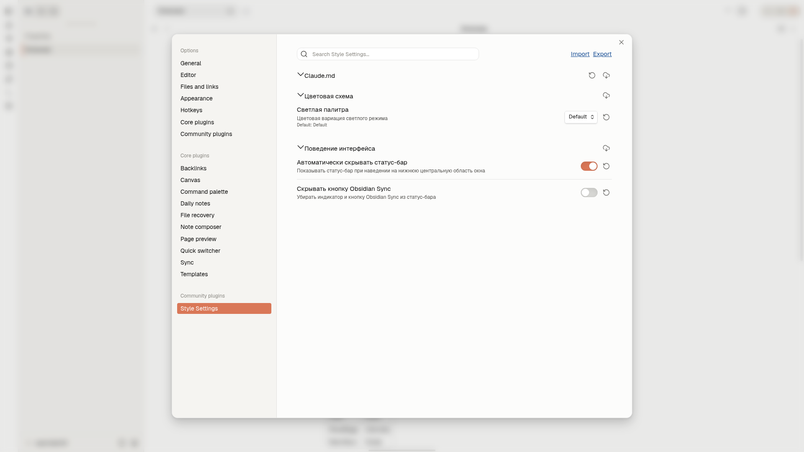
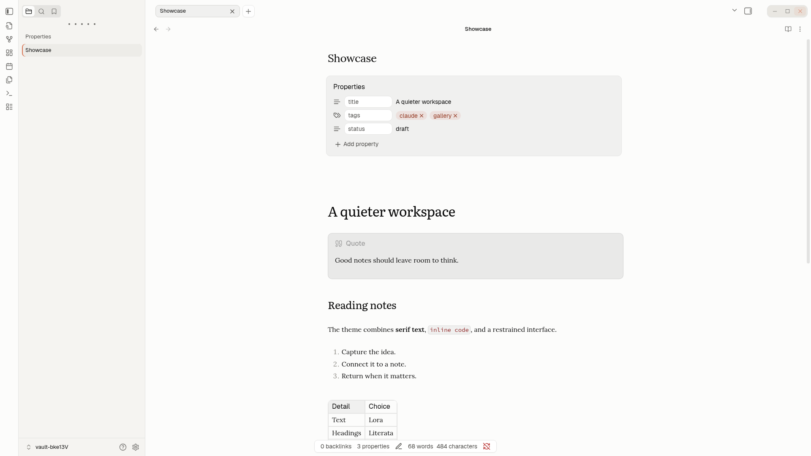

# Screenshot gallery

The images in this directory are generated by real Obsidian in the locked Linux container.
Run `npm run gallery`; it stages every image, validates dimensions and links, then replaces
this directory only after a successful capture. See [`tools/gallery/README.md`](../../tools/gallery/README.md).

## Overview

| Default light | Warm light | Dark |
| --- | --- | --- |
|  |  |  |

## Interface states

### Live-preview headings

### Rich Markdown

### Properties

### Quick switcher

### Command palette

### Style Settings

### Expanded status bar

## Community thumbnail

