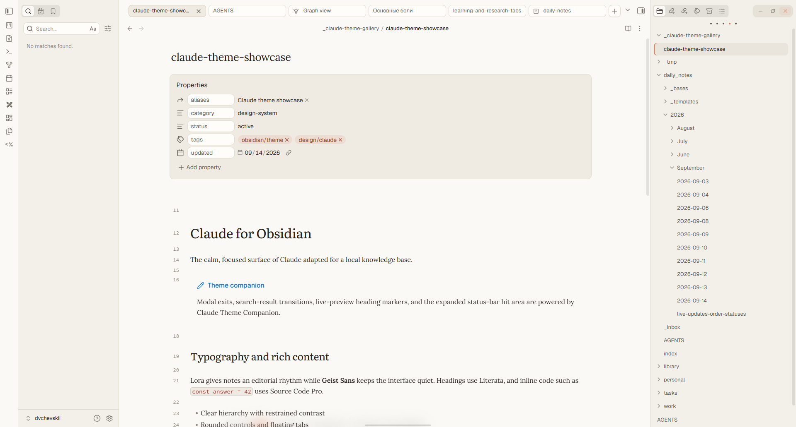
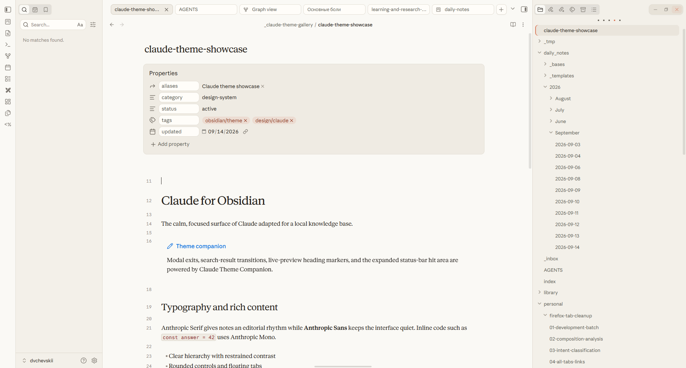
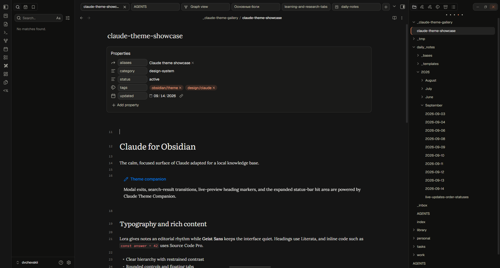
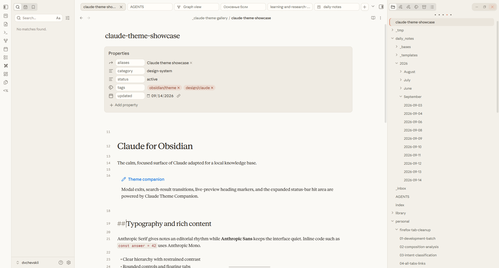
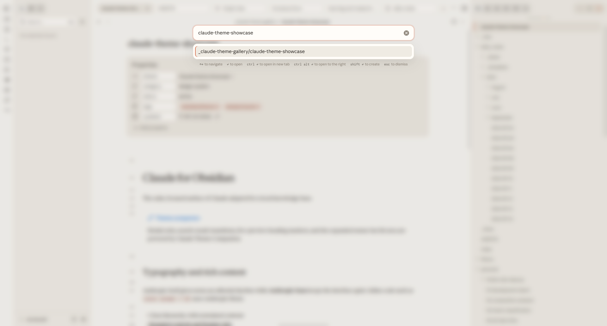
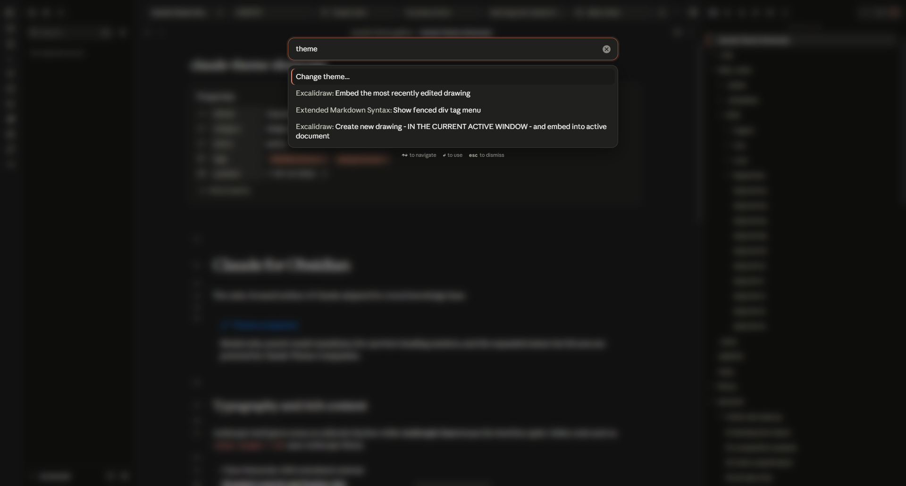
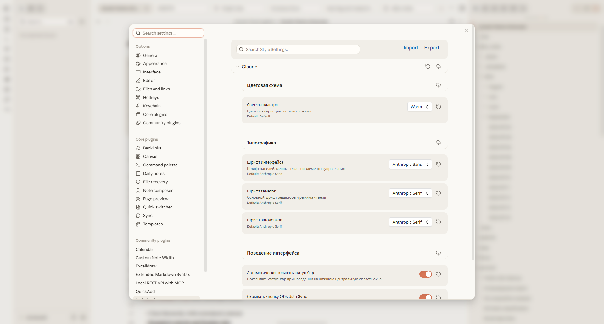
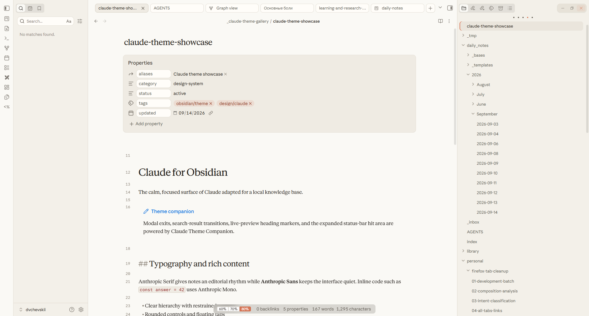
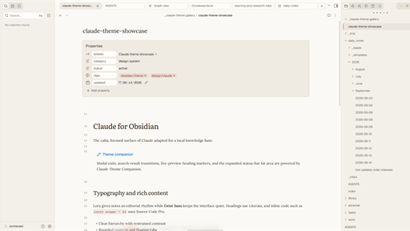

# Screenshot gallery

The images in this directory are generated by
[`scripts/generate-gallery.ps1`](../scripts/generate-gallery.ps1) against the
deterministic [`gallery/showcase.md`](../gallery/showcase.md) fixture.

## Overview

| Default light | Warm light | Dark |
| --- | --- | --- |
|  |  |  |

## Companion interactions

### Live-preview headings

### Quick switcher

### Command palette

### Style Settings

### Expanded status bar

## Community thumbnail

